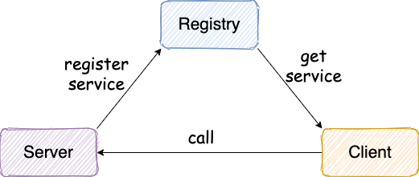

# RPC

### 一个基本的 RPC 框架设计思路

> **注意** ：我们这里说的 RPC 框架指的是：可以让客户端直接调用服务端方法就像调用本地方法一样简单的框架，比如我前面介绍的 Dubbo、Motan、gRPC 这些。 如果需要和 HTTP 协议打交道，解析和封装 HTTP 请求和响应。这类框架并不能算是“RPC 框架”，比如 Feign。

## 简易架构图
一个最简单的 RPC 框架使用示意图如下图所示

服务提供端 Provider 向注册中心注册服务，服务消费者 Consumer 通过注册中心拿到服务相关的信息，然后通过网络请求拿到服务提供端 Provider。

## **Dubbo** 的简易架构图如下

我们解释一下Dubbo这幅架构图

**Consumer :** 服务消费者 **Provider :** 服务提供者 **Registry :** 注册中心 **Monitor :** 监控中心(RPC框架中可以选择是否)

**直线-同步**  **虚线-异步**

1. 服务提供者Provider发布自己到服务注册中心
2. 服务消费者Consumer从服务注册中心订阅服务
3. Consumer消费者同步invoke 调用服务提供者Provider
> **第3步** 实际上Provider对于Consumer来说是透明的，上一次调用和这一次调用的ip地址是不确定的，这里就需要Registry注册中心进行服务容器Container的负载均衡

## 本RPC框架实际调用链路

